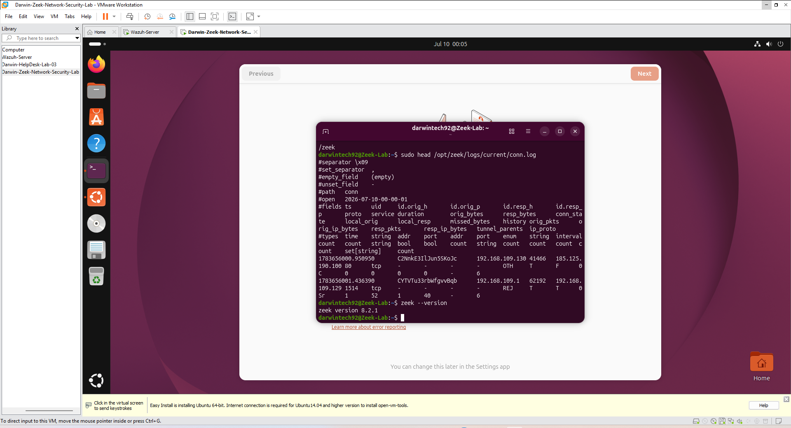
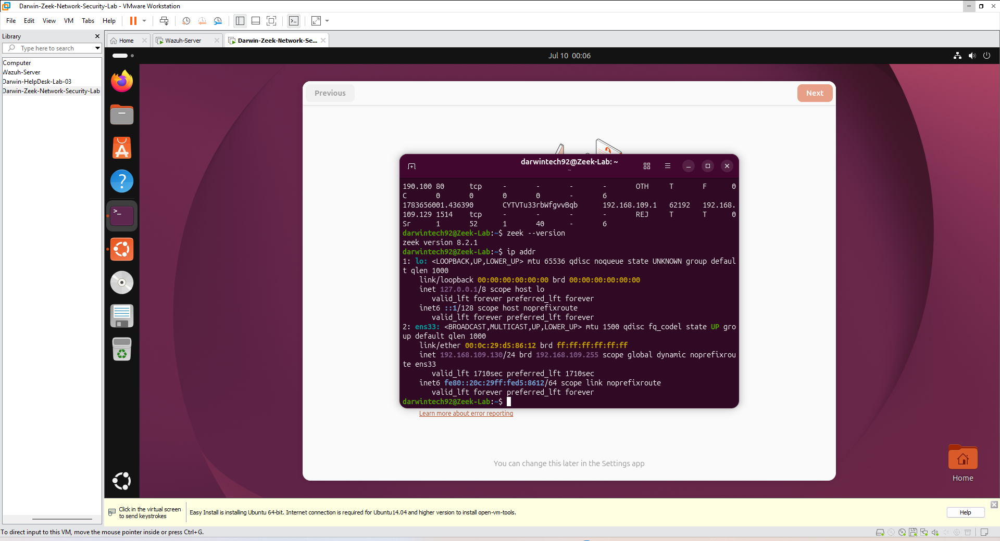
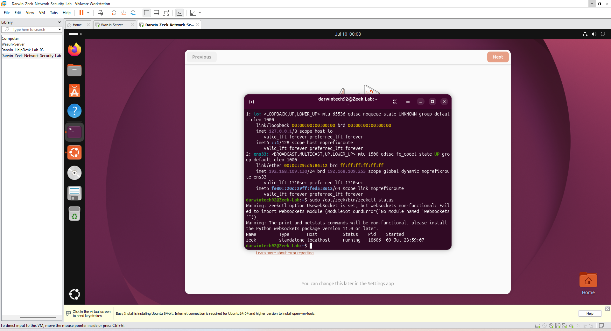
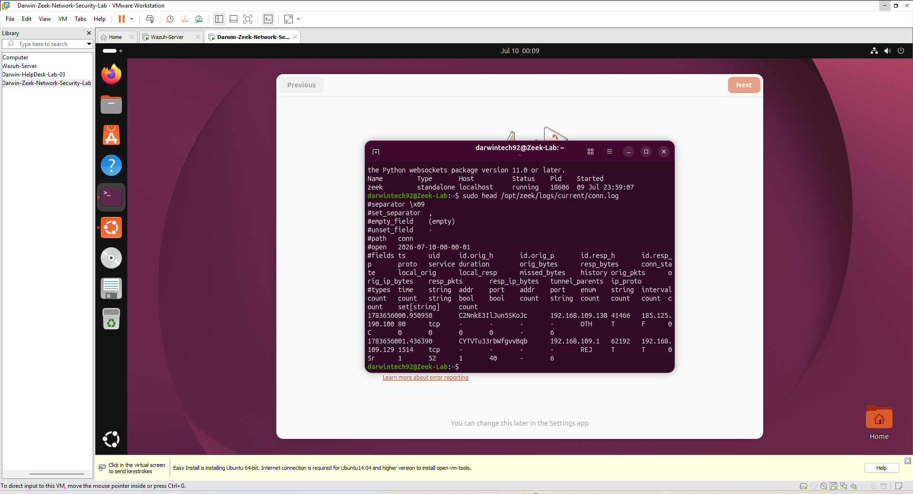
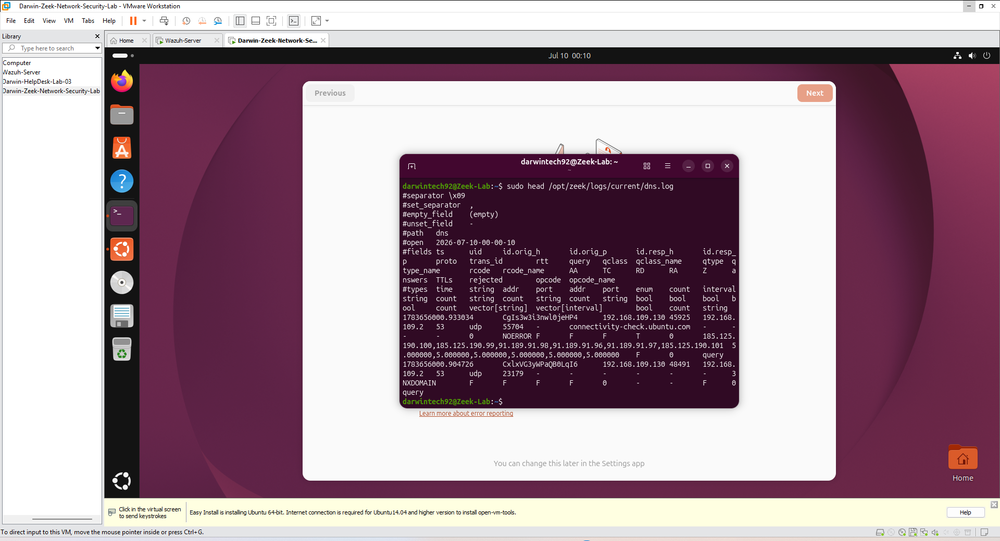
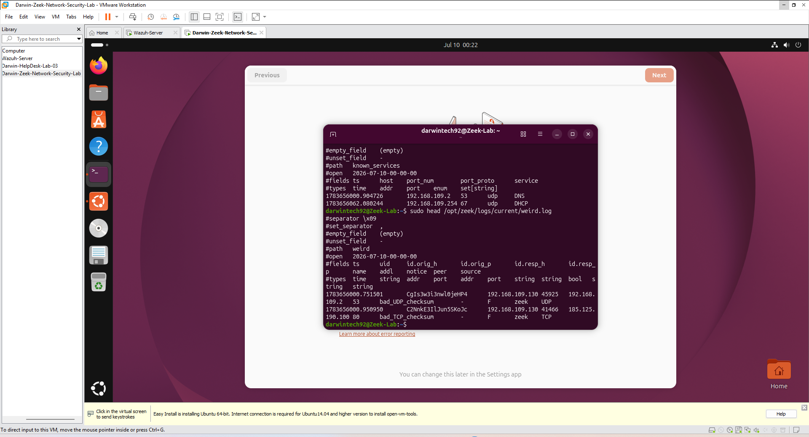
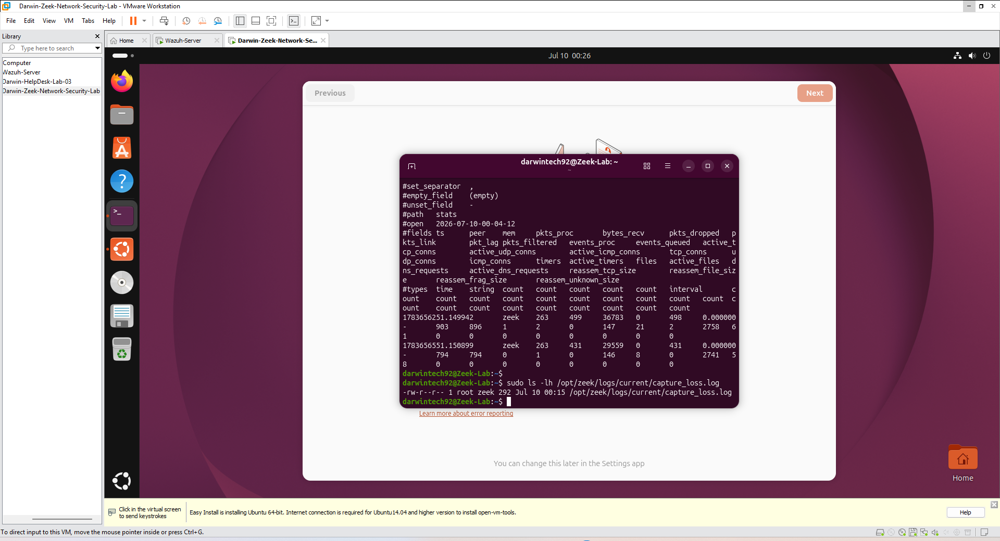
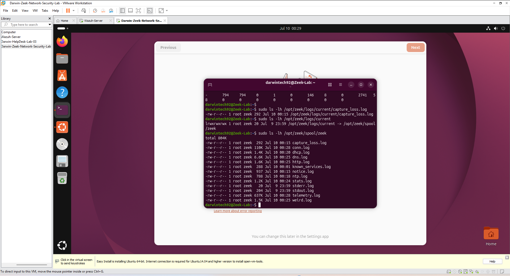

# -Darwin-Zeek-Network-Security-Lab
Hands-on Zeek Network Security Monitoring lab demonstrating installation, network traffic analysis, protocol logging, and network visibility using Ubuntu Linux and Zeek IDS.

## Overview

This project demonstrates the installation, configuration, and operation of **Zeek (formerly Bro)**, an open-source Network Security Monitor (NSM). The lab captures live network traffic and analyzes multiple network protocols through Zeek's powerful logging system.

The project showcases practical SOC analyst skills including network monitoring, protocol analysis, log investigation, and security event visibility.

---

## Objectives

- Install Zeek on Ubuntu Linux
- Configure the correct network interface
- Verify Zeek services are running
- Generate live network traffic
- Analyze Zeek log files
- Investigate network activity through protocol logs
- Demonstrate network security monitoring

---

## Technologies Used

- Ubuntu Linux
- Zeek 8.x
- VMware Workstation
- Linux Terminal
- TCP/IP
- DNS
- HTTP
- ICMP
- Network Security Monitoring (NSM)

---

## Skills Demonstrated

- Network Security Monitoring
- Zeek Installation
- Linux Administration
- Log Analysis
- Protocol Analysis
- Network Traffic Investigation
- Command Line Operations
- SOC Analyst Fundamentals

---

# Screenshots

## 1. Zeek Version Verification

Confirmed Zeek was successfully installed and verified the installed version.

---

## 2. Network Interface Configuration

Verified the active network adapter used by Zeek for packet capture.

---

## 3. Zeek Service Status

Verified that the Zeek monitoring service is running successfully.

---

## 4. Connection Log

Displayed network connection activity captured in the Zeek `conn.log` file.

---

## 5. DNS Log

Analyzed DNS requests and responses recorded by Zeek.

---

## 6. HTTP Log

Reviewed HTTP web traffic captured during live network monitoring.

---

## 7. Notice Log

Examined security notices and alerts generated by Zeek.

---

## 8. Known Services Log

Displayed automatically identified network services running on observed hosts.

---

## 9. Weird Log

Investigated unusual or unexpected network behaviors detected by Zeek.

---

## 10. Statistics Log

Reviewed Zeek performance statistics and packet processing metrics.

---

## 11. Capture Loss Log

Verified packet capture performance and monitored packet loss statistics.

---

## 12. Zeek Log Directory

Displayed the complete collection of Zeek log files generated during network monitoring.

---

# What I Learned

- Installing and configuring Zeek on Ubuntu
- Verifying network interfaces for monitoring
- Starting and managing Zeek services
- Monitoring live network traffic
- Understanding Zeek log structure
- Investigating DNS, HTTP, and connection activity
- Identifying network services
- Reviewing security notices and anomalies
- Measuring packet capture performance
- Using Zeek as a Network Security Monitor in a SOC environment

---

# Author

**Darwin Brown**
